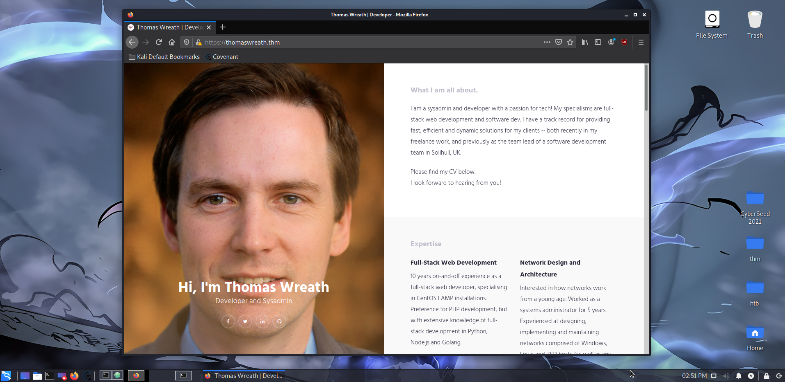
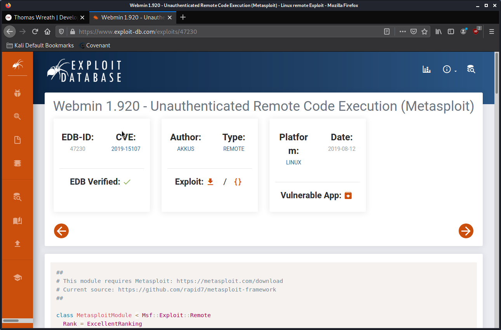

# website enumeration

ran nmap command:

```bash
sudo nmap -Pn -vv -A -oA scans 10.200.187.200 -p 1-15000
```

output: scans.xml

summary nmap scan:

```bash
sudo nmap -sV 10.200.187.200 -p 1-15000
```

output:

```
PORT      STATE  SERVICE    VERSION
22/tcp    open   ssh        OpenSSH 8.0 (protocol 2.0)
80/tcp    open   http       Apache httpd 2.4.37 ((centos) OpenSSL/1.1.1c)
443/tcp   open   ssl/http   Apache httpd 2.4.37 ((centos) OpenSSL/1.1.1c)
9090/tcp  closed zeus-admin
10000/tcp open   http       MiniServ 1.890 (Webmin httpd)
```

OS is probably CentOS, with a web server running.

Opening the IP in my browser directed me to https://thomaswreath.thm/.

Changed the `/etc/hosts` file on AttackBox to add:

```bash
10.200.187.200 thomaswreath.thm
```

Website loads correctly now, screenshot of webiste:



Website contains PII like address, phone numbers, emails, etc.

Ran another nmap scan to discover service of web server:

```bash
sudo nmap -sV -sC -oA service_detect 10.200.187.200 -p 80,443
```

Scan results are in APPENDIX (service_detect.xml).

Researched about service running on port 10000 (MiniServ 1.890) and came across this website: https://www.exploit-db.com/exploits/47230

.
